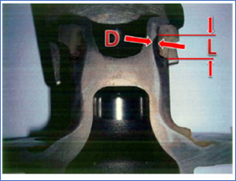

# Paper: Nonlinear Eddy Current Technique for Characterizing Case Hardening Profiles

## Overview

This repository provides an overview of the paper nonlinear eddy current technique for assessing case hardening profiles. The method uses a custom electromagnetic excitation-sensor array to measure nonlinear responses at multiple frequencies, enabling nondestructive characterization of case depth profiles.

“Nonlinear Eddy Current Technique for Characterizing Case Hardening Profiles” Published in IEEE Transactions on Magnetics, VOL. 46, NO. 6, JUNE 2010.

## Introduction

Industrial components, such as automotive bearing assemblies, are often case-hardened for durability. Traditional case-depth evaluation methods are destructive and time-consuming. This project introduces a novel nonlinear eddy current technique for nondestructive testing (NDT) by leveraging differences in magnetic properties between case-hardened and untreated regions.

A cross-sectional profile of the wheel bearing core is shown below. The lateral exterior surface of the core is case-hardened. The resulting hardening profile appears as darkened regions in the figure. The dimensions “L” and “D” in the figure represent the effective extent and maximum case depth, respectively.

## Methodology

The system excites the bearing core with a strong sinusoidal magnetic field, causing nonlinear magnetization responses. Sinusoidal excitations at different frequencies allow comparison between reference and test components. An array of excitation and detection coils ensures proper field penetration, and harmonic ratios extracted from the frequency spectrum are analysed using artificial neural networks and the ID3 algorithm.

### Electromagnetic Sensor Assembly

The electromagnetic sensor assembly consists of **4 excitation and 5 detection coils**. It employs a ferromagnetic core made from \*\*HyMu "80" alloy \*\* to reduce magnetic flux leakage and ensure penetration of the applied magnetic field into the case-hardened region of the bearing assembly. Two sensor assemblies—one for the reference and the other for the component under test—are connected in series in the inspection system. As the excitation coils have negligible capacitances, the series-connected coils produce a strong (**1.3 T**) magnetic field at a frequency between **5–300 Hz** to excite each component. The detection coils, meanwhile, form an array that is sensitive to spatial variations in the response field.

*Schematic diagram of the electromagnetic sensor assembly showing arrays of excitation and detection coils with a high-permeability alloy core.*

### Inspection Approach

The inspection approach compares the nonlinear responses between a reference and test bearing assembly. 

A sinusoidal excitation signal is applied to the series-connected excitation coils to subject both the reference and test parts to the same magnetic field. The corresponding sensor coils from the two assemblies are differentially connected such that the output represents the difference signal between the two coils. If the case profile of the test sample is similar to that of the reference sample, the amplitude of the output signals generated by the five coil pairs would be approximately zero. Otherwise, one or more of the outputs will be non-zero. The output signals are then processed and examined to determine the characteristics (L-dimension and core depth) of the case hardening profile.

### Machine Learning Focus:
- Applied artificial neural networks and the ID3 algorithm for classification with high accuracy.
- Designed a custom excitation-sensor array for ML model training and validation.
- Used a multilayer perceptron model with backpropagation for optimal classification.
- Employed decision tree techniques to enhance classification reliability.
- Demonstrated ML effectiveness in industrial nondestructive evaluation.

## References
S. C. Chan, R. Grimberg, J. A. Hejase, et al., "Nonlinear Eddy Current Technique for Characterizing Case Hardening Profiles," *IEEE Transactions on Magnetics*, vol. 46, no. 6, pp. 1821-1824, 2010.
