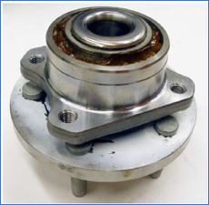
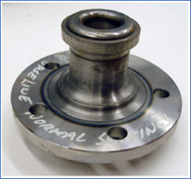

# Paper: Nonlinear Eddy Current Technique for Characterizing Case Hardening Profiles

## Overview

This repository provides an overview of the implementation of machine learning to solve a difficult industrial problem on the utilization of nonlinear eddy current technique for assessing case hardening profiles of automotive car wheel bearings.
The data we used in training the model was acquired using a custom electromagnetic excitation array that measures nonlinear eddy current responses at multiple frequencies. 
The full paper can be accessed here https://ieeexplore.ieee.org/document/5467463

### Machine Learning Focus:
- Applied artificial neural networks and the ID3 algorithm for classification with high accuracy.
- Designed a custom excitation-sensor array for ML model training and validation.
- Used a multilayer perceptron model with backpropagation for optimal classification.
- Employed decision tree techniques to enhance classification reliability.
- Demonstrated ML effectiveness in industrial nondestructive evaluation.

## Introduction / Problem Statement

Industrial components, such as automotive bearing assemblies, are often case-hardened for durability. Traditional case-depth evaluation methods are destructive and time-consuming. This project introduces a novel nonlinear eddy current technique for nondestructive testing (NDT) by leveraging differences in magnetic properties between case-hardened and untreated regions.

A cross-sectional profile of the wheel bearing core is shown below. The lateral exterior surface of the core is case-hardened. The resulting hardening profile appears as darkened regions in the figure. The dimensions “L” and “D” in the figure represent the effective extent and maximum case depth, respectively.

## Methodology / Data Collection & Pre-Processing

The system excites the bearing core with a strong sinusoidal magnetic field, causing nonlinear magnetization responses. Sinusoidal excitations at different frequencies allow comparison between reference and test components. An array of excitation and detection coils ensures proper field penetration, and harmonic ratios extracted from the frequency spectrum are analysed using artificial neural networks and the ID3 algorithm.

### Electromagnetic Sensor Assembly

The electromagnetic sensor assembly consists of **4 excitation and 5 detection coils**. It employs a ferromagnetic core made from \*\*HyMu "80" alloy \*\* to reduce magnetic flux leakage and ensure penetration of the applied magnetic field into the case-hardened region of the bearing assembly. Two sensor assemblies—one for the reference and the other for the component under test—are connected in series in the inspection system. As the excitation coils have negligible capacitances, the series-connected coils produce a strong (**1.3 T**) magnetic field at a frequency between **5–300 Hz** to excite each component. The detection coils, meanwhile, form an array that is sensitive to spatial variations in the response field.

*Schematic diagram of the electromagnetic sensor assembly showing arrays of excitation and detection coils with a high-permeability alloy core.*

### Inspection Approach

The inspection approach compares the nonlinear responses between a reference and test bearing assembly. 

A sinusoidal excitation signal is applied to the series-connected excitation coils to subject both the reference and test parts to the same magnetic field. The corresponding sensor coils from the two assemblies are differentially connected such that the output represents the difference signal between the two coils. If the case profile of the test sample is similar to that of the reference sample, the amplitude of the output signals generated by the five coil pairs would be approximately zero. Otherwise, one or more of the outputs will be non-zero. The output signals are then processed and examined to determine the characteristics (L-dimension and core depth) of the case hardening profile.

### Feature Extraction & ML Model Training

From the frequency spectrum of each difference signal, the ratios of the third to first harmonics and the fifth to first harmonics are obtained. With four difference signals collected at each excitation frequency, a total of eight ratios are generated. Since the inspection system uses three excitation frequencies, this results in 24 harmonic ratios, which together form the feature vector for the bearing assembly under test. Signal classification algorithms are then applied to this feature vector to characterize the underlying case profile.
 

Two signal classification algorithms are used in the nonlinear eddy current inspection system: 
- An artificial neural network
- Iterative Dichotomiser 3 (ID3) algorithm

## Results & Conclusion

Master lots of bearing assemblies with various known L-dimensions and associated core depths have been custom manufactured for evaluating the inspection system. These master lots are categorized into four classes based on manufacturer specifications: Accept, Baseline Accept, Baseline Reject, and Reject. The specifications for these master lots are provided in Table I

### Table I: Specifications of master lots categorized into Accept, Baseline Accept, Baseline Reject, and Reject based on core depth and manufacturer criteria.

| Lot | L-Dimension (mm) | Core Depth (mm) | Condition |
|----|----------------|----------------|-----------|
| 1  | 10.6          | 5              | Accept    |
| 2  | 11.7-11.82    | 4              | Baseline Accept |
| 3  | 12.75        | 3.5            | Baseline Reject |
| 4  | 13.9-14      | 2.8            | Reject    |

The inspection system was tested using these master lots with both the neural network and ID3 algorithms. The classification results of previously untrained samples are presented in Table II, showing an overall accuracy of 95.77%, though the Baseline Reject parts had a higher misclassification rate of 14.29%.

### Table II: Neural network classification results, achieving 95.77% overall accuracy but showing a 14.29% error for Baseline Reject parts.

| Sample Group     | No. of Parts Tested | No. of Parts Correctly Classified | Accuracy |
|-----------------|---------------------|----------------------------------|----------|
| Accept         | 13                  | 13                               | 100%     |
| Baseline Accept | 20                  | 20                               | 100%     |
| Baseline Reject | 21                  | 18                               | 85.71%   |
| Reject         | 17                  | 17                               | 100%     |

For the ID3 algorithm, 100 samples were used for training and 69 for testing. The composition of the training and testing sample groups, as well as the classification results, are listed in Table III. 

### Table III: ID3 algorithm classification results, with 95.65% overall accuracy and a more evenly distributed error across categories.

| Sample Group     | No. of Training Parts | No. of Test Parts | No. of Parts Correctly Classified | Accuracy |
|-----------------|---------------------|----------------|----------------------------------|----------|
| Accept         | 17                  | 12             | 12                               | 100%     |
| Baseline Accept     | 30                  | 20             | 19                               | 95%      |
|  Baseline Reject     | 30                  | 21             | 20                               | 95.23%   |
| Reject         | 23                  | 16             | 15                               | 93.75%   |

The system correctly classified the Accept parts, and presented a 5%, 4.77% and 6.25% error for the Baseline Accept, Baseline Reject and Reject parts, respectively.

A novel nonlinear eddy current inspection technique has been developed for characterizing the case depth profile of a component, making it suitable for both general applications and scenarios where the case-hardened region is not easily accessible. Its application to automotive bearing assemblies with complex geometries has demonstrated an impressive accuracy of approximately 95.7% in identifying acceptable assemblies. This technique shows great promise in effectively characterizing the case profile of induction-hardened parts, making it a valuable tool for quality assessment in industrial settings.

## Acknowledgment

The authors thank S. Brown and P. Predmesky of SKF Automotive Division (Plymouth, MI) for the technical support and providing bearing assemblies for testing. This work was supported by a Grant from SKF USA, 

## References
S. C. Chan, R. Grimberg, J. A. Hejase, et al., "Nonlinear Eddy Current Technique for Characterizing Case Hardening Profiles," *IEEE Transactions on Magnetics*, vol. 46, no. 6, pp. 1821-1824, 2010.
